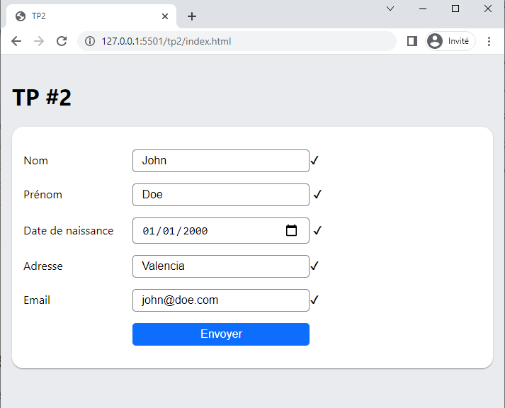
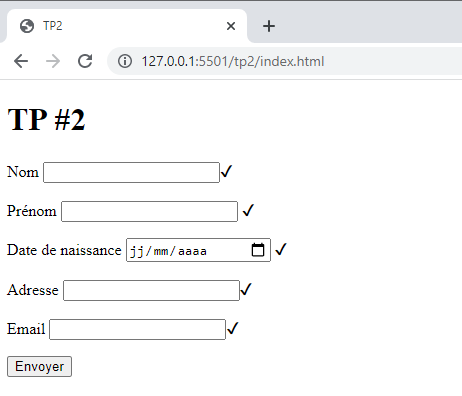
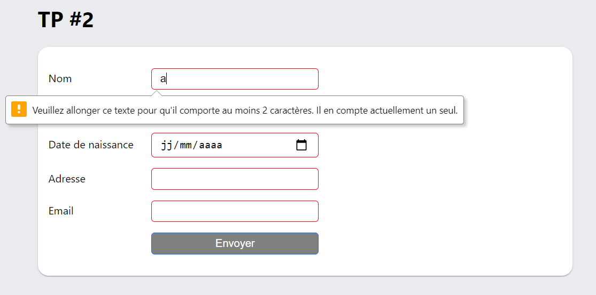
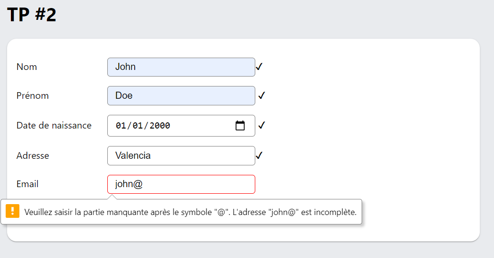
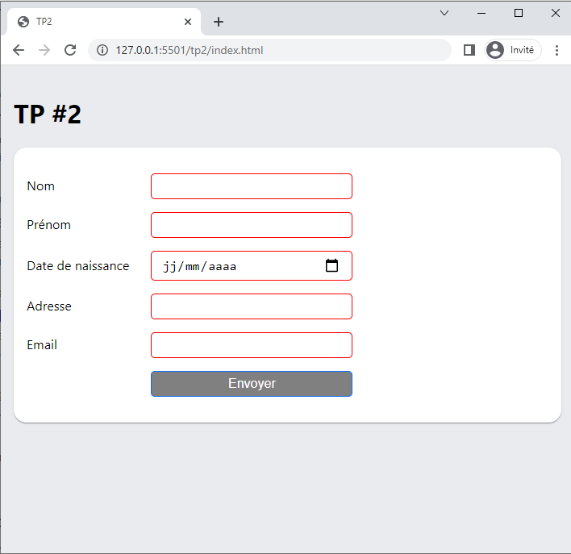
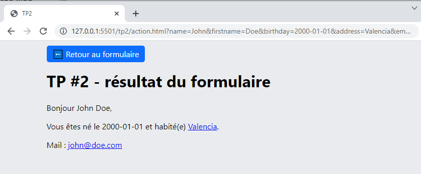
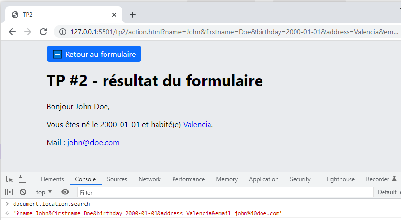
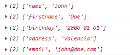

<div  align="center">
TP2


Master 3IR
TP AW #2 : HTML & Javascript

Validation de formulaire et lecture de données en JavaScript.

 


</div>

- [Plate-forme de développement :](#plate-forme-de-développement-)
- [Spécification des champs de saisie](#spécification-des-champs-de-saisie)
- [1. Formulaire HTML](#1-formulaire-html)
    - [1. Exemple de code pour le champ "prénom" :](#1-exemple-de-code-pour-le-champ-prénom-)
    - [2. Bouton de soumission de formulaire](#2-bouton-de-soumission-de-formulaire)
    - [3. Validation du formulaire en HTML5](#3-validation-du-formulaire-en-html5)
- [2.  Style CSS du formulaire](#2--style-css-du-formulaire)
    - [2.1. Cas du formulaire non valide](#21-cas-du-formulaire-non-valide)
  - [2.2. Cas d'un champ non valide](#22-cas-dun-champ-non-valide)
  - [2.3. Cas d'un champ valide](#23-cas-dun-champ-valide)
- [3. Page action.html - lecture des données en javascript](#3-page-actionhtml---lecture-des-données-en-javascript)
    - [Extraction des données](#extraction-des-données)
  - [Lien hypertexte pour l'adresse](#lien-hypertexte-pour-ladresse)
  - [Lien de courriel pour l'email](#lien-de-courriel-pour-lemail)


#  Plate-forme de développement : 
* [Visual Studio Code](https://code.visualstudio.com), Eclipse ou un Éditeur de texte (notepad++, emacs, …)
* Navigateur web (Google Chrome ou Mozilla Firefox)


Support technique : 
 - http://www.w3schools.com/js/default.asp
 - https://developer.mozilla.org/fr/docs/Web/HTML/Element/Form


 # Spécification des champs de saisie

Le formulaire utilisera la méthode d'envoi `get` et enverra les informations saisie à la page "action.html".

Les champs de saisie, avec leurs contraintes techniques, sont les suivants :
* Nom (type: `text`, name: `name`, minimum: 2 caractères, max: 20 car.)
* Prénom (type: `text`, name: `firstname`, minimum: 2 caractères, max: 20 car.)
* Date de naissance (type: `date`, name: `birthday`)
* Adresse postale (type: `text`, name: `address`, minimum: 5 caractères, max: 50 car.)
* Adresse mail (type: `email`, name: `email`, minimum: 5 caractères, max: 30 car.)
* 👉Tous ces champs de saisie sont obligatoires (👉 attribut `required` https://developer.mozilla.org/fr/docs/Web/HTML/Attributes/required)

# 1. Formulaire HTML

  - Dans le votre dossier **tp2**, modifier le fichier index.html
  - Écrire le code HTML pour afficher tous les champs de saisie `input` (la mise en forme se fera plus tard dans ce TP)
  
  
  - On utilisera la balise `form` qui enverra les informations du formulaire vers une page `action.html` 
  ```html
    <form action="action.html" method="get">
      <!-- votre code html avec tous les champs de saisie-->
    </form>
  ```
  - Documentation sur les formulaires : https://developer.mozilla.org/fr/docs/Web/HTML/Element/Form

 - Chaque champ de saisie `input`  devra avoir  :
     - les attributs HTML adéquates pour respecter les spécifications détaillées plus haut 
     - un label associé
     - un émoji `✔` pour indiquer que la saisie est valide        

### 1. Exemple de code pour le champ "prénom" :
```html
<p>
  <label for="firstname">Prénom</label>
  <input
    type="text"
    name="firstname"
    minlength="2"
    maxlength="20"
    required
  />
  <span class="icon-ok">✔</span>
</p>
```

  
  ### 2. Bouton de soumission de formulaire 
  Code HTML pour le bouton de validation 
    
      ```html
      <input type="submit"/>
      ```
  ### 3. Validation du formulaire en HTML5


Grâce à l'attribut `required` utilisé pour tous les champs de saisie, la validation du formulaire se fera directement par le navigateur web.


Au clique sur le bouton "Envoyer", le navigateur affichera un message sous le premier champ non valide.

👉Pour plus de détails:  https://developer.mozilla.org/fr/docs/Learn/Forms/Form_validation#utiliser_la_validation_int%C3%A9gr%C3%A9e_au_formulaire


<p align="center">

<em>Ici le champ "nom" n'a pas assez de caractères</em>
</p>


<p align="center">

<em>Ici le champ "email" n'a pas le bon format d'adresse mail</em>
</p>


# 2.  Style CSS du formulaire
   

  Créer un fichier `style.css` et y faire référence dans le fichier `index.html`

  ```html
  <link rel="stylesheet" href="style.css" />
   ```


   1. vous utiliserez ces styles CSS pour aligner tous les labels et `input`
      ```css
      label {
        width: 150px;
        display: inline-block;
      }
      input {
        width: 250px;
        padding: 6px 12px;
        border-radius: 5px;
        border: 1px solid gray;
        font-size: 1rem;
        box-sizing: border-box; /* pour s'assurer que les margin/padding n'impacte pas la largeur width */
      }
      ```

   1. Le formulaire `form` devra : 
      - avoir un fond blanc
      - une bordure arrondi de `16px`
      - un padding de  `16px`
      - une ombre portée avec cette valeur: 
          ```css
          box-shadow: 0 2px 1px -1px #0003, 0 1px 1px #00000024, 0 1px 3px #0000001f;
          ```
  1. Les champs de saisie `input` devront avoir: 
     - une taille de caractère de `1em`
     - une bordure arrondi de `5px`
     - un padding de `6px` en hauteur et `12px` en largeur : 
        ```css
        padding: 6px 12px;
        ```
  2. Le bouton de soumission aura : 
     - une classe `btn-primary` dont les propriétés CSS sont : 
        ```css
        .btn-primary {
          border-radius: 5px;
          padding: 6px 12px;
          background-color: #0d6efd;
          border-color: #0d6efd;
          color: #fff;
          cursor: pointer;
          text-decoration: none;
        }
        ```

 ### 2.1. Cas du formulaire non valide
   - Cibler le formulaire et grisé le bouton submit
      ```css
      form:invalid input[type="submit"] {
        background-color: gray;
      }
      ```

  ## 2.2. Cas d'un champ non valide

   - cibler les champs invalide avec la pseudo-classe `:invalid` (https://developer.mozilla.org/fr/docs/Web/CSS/:invalid)
     - appliquer une bordure de couleur rouge
   - cacher l'émoji en ciblant la classe `emoji-ok` qui se trouvent juste aprés un champ valide :
        ```css
        input:invalid + .icon-ok {
          display: none;
        }
        ```
      Le `+` permet de cibler seulement l'élément HTML placer juste aprés `input:invalid` (https://www.w3schools.com/CSSref/sel_element_pluss.php) 

## 2.3. Cas d'un champ valide
   
  

  - cibler les éléments qui ont la classe `emoji-ok` et qui se trouvent juste aprés un champ valide (pseudo-classe `:valid`  https://developer.mozilla.org/fr/docs/Web/CSS/:valid) comme ceci : 
  
      ```css
      input:valid + .icon-ok {
        display: inline-block;
      }
      ```
  
# 3. Page action.html - lecture des données en javascript
Les données sont envoyées à cette page via l'URL et seront visibles dans la barre d'adresse sous cette forme : 

`?name=John&firstname=Doe&birthday=2000-01-01&address=Valencia&email=john%40doe.com`
 1. Créer un fichier action.html
 2. Créer un fichier action.js qui va contenir le code Javascript où l'URL sera lue.
 
    - Y faire référence dans votre code HTML (entre les balises HEAD) de la page action.html
 ` <script type="text/javascript" src="action.js"></script> `

 3. Faire référence aussi à la feuille CSS utilisée précédement
    ```html
    <link rel="stylesheet" href="style.css" />
    ```


Dans le fichier HTML, nous devons écrire la structure HTML pour afficher les données réçues par le formulaire : 



En haut de la page une balise `<a>` "⬅️ Retour au formulaire" redigera vers la page `index.html`.
  Une classe CSS 'btn-primary' permettra de lui donner le même rendu que le bouton `submit`.


Nous utilisons les attributs `id` pour répérer les éléments HTML qui seront valorisés en JavaScript : 

```html
<body>
  <a href="index.html" class="btn-primary">⬅️ Retour au formulaire</a>

  <h1>TP #2 - résultat du formulaire</h1>
  <div>
    <p>Bonjour <span id="name"></span> <span id="firstname"></span>,</p>
    <p>
      Vous êtes né le <span id="birthday"></span>
      et habité(e)
      <a href="" id="address" target="_blank"></a>.
    </p>
    <p>
      Mail :
      <a href="" id="email"></a>
    </p>
  </div>
</body>
```


    1. Dans le fichier javaScript `action.js`, pour lire les données contenus dans l'URL , nous  allons lire la propriété javaScript `document.location.search` : https://developer.mozilla.org/en-US/docs/Web/API/Location/search
   
   `document.location.search` nous renvoie une chaine de caractère: '?name=John&firstname=Doe&birthday=2000-01-01&address=Valencia&email=john%40doe.com'

   👉 Dans la console de Chrome, éxécuter la commande `document.location.search` pour voir sa valeur: 

   


### Extraction des données

   Pour extraire les données de chaque champ de saisie contenue dans `document.location.search`, nous allons utiliser la fonction URLSearchParams https://developer.mozilla.org/fr/docs/Web/API/URLSearchParams et faire une boucle comme ceci:

```js   
window.onload = () => { // https://developer.mozilla.org/fr/docs/Web/API/Window/load_event
  const paramsString = document.location.search; // récupérer des données envoyées par le formulaire
  const searchParams = new URLSearchParams(paramsString); // https://developer.mozilla.org/fr/docs/Web/API/URLSearchParams

  // Iterating the search parameters
  for (const param of searchParams) {
    console.log(param);

    const elementId = param[0];
    const elementValue = param[1];
    const element = document.getElementById(elementId);
    
    if (element !== null) {
      element.textContent = elementValue;
    }
    if (param[0] === "address") {
       element.href = `https://www.google.com/maps/search/?api=1&query=${elementValue}`;
    } else if (param[0] === "email") {
       element.href = `mailto:${elementValue}?subject=Hello!&body=What's up?`;
    }
  }
};
```
   
En bouclant sur `URLSearchParams`, pour chaque nous récupérer un tableau avec :
-  l'identitiant du champ de saisie 
-  et sa valeur
   
  
<div  align="center">
<center>
  

  
Affichage des informations dans la console de débuggage du navigateur 
</center>
  </div>


  Pour cibler chaque élément HTML avec son identifiant, nous allons utiliser la fonction `document.getElementById` https://developer.mozilla.org/en-US/docs/Web/API/Document/getElementById

```js
const element = document.getElementById(param[0]);
```
Pour nous mettons à jour son contenu avec la méthode textContent https://developer.mozilla.org/en-US/docs/Web/API/Node/textContent
```js
if (element !== null) {
  element.textContent = param[1];
}
```


## Lien hypertexte pour l'adresse 

👉 Pour l'adresse, il faudra afficher proposer un lien hypertexte (URL) vers Google Maps en utilisant ce pattern : `https://www.google.com/maps/search/?api=1&query=${addressValue}`
👉 Pour l'adresse mail, il faudra afficher proposer un lien de courriel en utilisant ce pattern : `mailto:${emailValue}?subject=Hello!&body=What's up?`


💡 Pour intégrer facilement des variables dans une chaîne de caractères, nous utilisons les `Template literals` :  https://developer.mozilla.org/en-US/docs/Web/JavaScript/Reference/Template_literals


```js
if (param[0] === "address") {
      const addressValue = param[1];
      element.href = `https://www.google.com/maps/search/?api=1&query=${addressValue}`;
    }
```


  ## Lien de courriel pour l'email 
  Pour le lien de courriel, nous mettons à jour l'attribut `href` de la balise `<a href="" id="address" target="_blank"></a>`
```js
if (param[0] === "email") {
  const emailValue = param[1];
  element.href = `mailto:${emailValue}?subject=Hello!&body=What's up?`;
}
```

<hr/>
<div  align="center">
<center> ~ Fin du TP ~  </center></div>